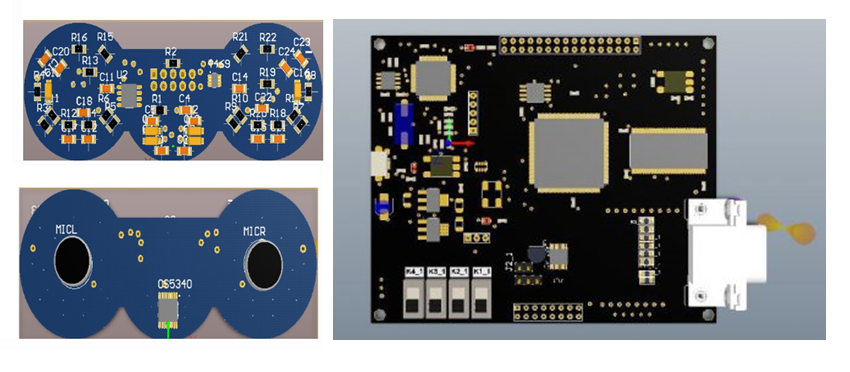
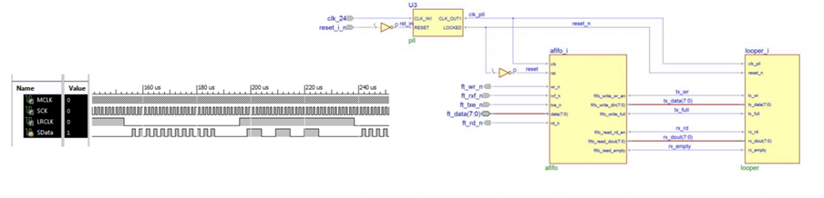
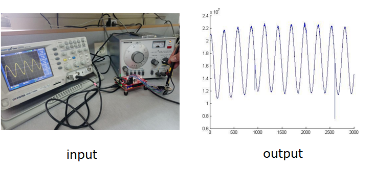

# Design and Implementation of Microphone Array using Spartan-6

Files
---------------------------------------

### CS5340
  The CS5340 performs sampling, A/D conversion and anti-alias filtering, generating 24-bit values for both left and right inputs in serial form at sample rates up to 200 kHz per channel.
  
 ### FT2232H
We used FT2232H for transferring data and programming the FPGA without JTAG . The FT2232H is a USB 2.0 Hi-Speed (480Mb/s) to UART/FIFO IC. This IC used for sending data to the PC . 
 
 ### Board ( Schematic and Pcb designing )
 Also we design a customized board for Spartan6 (XC6SLX9-2TQG144C)

 
 ### Matlab 
 matlab code for playing the voice 
 
 ### Verilog
 In the main of this project we implement I2S protocol by Verilog and UART/FIFO IC protocol by HLS.

 ### Visual Studio 
 C code for receiving data from FT2232H
 
Test
---------------------------------------
when the input is very low amplitude sinusoid. We get this output with wide range of frequency.

Youtube video : https://www.youtube.com/watch?v=ECHrWBCQf3o&feature=youtu.be

Sources
---------------------------------------
This project has direct and indirecet collaborators. 
You can find related documents in `documents` folder 

